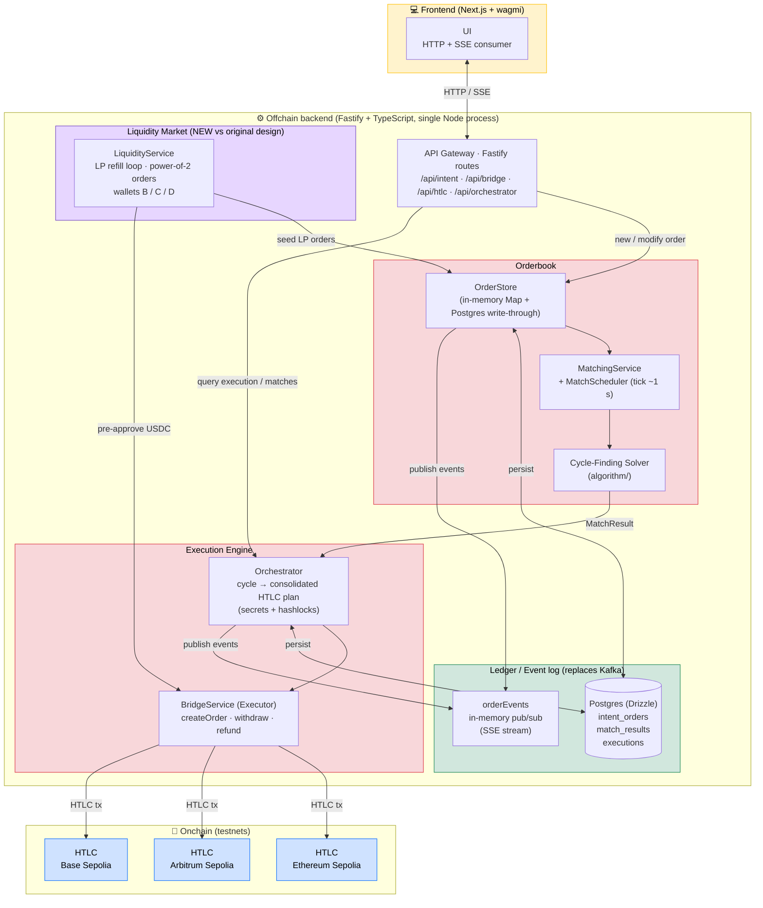

# OceanLink — Current Architecture

This diagram reflects what is **actually implemented** in this repository,
not the long-term design intention. Notable deltas from the original
intention diagram are listed below.

## Components and interactions

A description of each component, its role, and how it talks to the
others. Use this as the brief for drawing the architecture; spatial
layout is up to the illustrator.

### Components / actors

- **HTLC contracts (on-chain).** Three identical Hashed Time-Locked
  Contracts deployed on Ethereum Sepolia, Arbitrum Sepolia, and Base
  Sepolia. They expose `createOrder` (lock funds against a hashlock
  + timelock), `withdraw` (release funds with the matching preimage),
  and `refund` (return funds after timelock expiry). They are the
  settlement layer.

- **Frontend (Next.js + wagmi + Viem).** The user-facing client. It
  signs intents locally with the user's wallet, submits them to the
  API Gateway, and subscribes to a Server-Sent Events stream to follow
  an order's lifecycle. On-chain reads (balances, allowances) are
  done directly via wagmi without going through the backend.

- **API Gateway (Fastify routes).** The only inbound entry point of
  the backend. Validates incoming requests, accepts new intents,
  exposes query endpoints for matches/executions, and terminates the
  SSE stream that delivers live order events to the frontend.

- **OrderStore.** The orderbook. An in-memory primary index by
  `orderId` plus a secondary index by chain pair (`src→des`), plus an
  append-only history of past match results. It is the single
  source of truth at runtime and is mirrored write-through to
  Postgres. On boot it is rehydrated from Postgres.

- **MatchingService + MatchScheduler.** The heartbeat. The scheduler
  fires a tick every ~1 second; each tick the service expires
  deadlines, snapshots the active orderbook, asks the Solver for
  cycles, marks affected orders MATCHED/PARTIAL, and emits a
  `MatchResult` for the Orchestrator.

- **Cycle-Finding Solver.** The matching algorithm. It treats the
  active orderbook as a directed weighted multigraph (edges = orders,
  weight = effective USDC amount including incentive fee) and returns
  cycles whose minimum-weight edge is the volume that can be
  exchanged atomically.

- **LiquidityService.** A self-driving liquidity provider. It owns
  three LP wallets (B, C, D), one per source chain, and continuously
  seeds the OrderStore with power-of-2 USDC orders so any user
  amount in [1, 10 000] can be filled by a greedy combination. A
  refill loop replaces orders that get matched or expire. It also
  pre-approves USDC for its own wallets via the BridgeService.

- **Orchestrator.** The execution planner. Given a batch of
  `MatchResult`s, it consolidates per-chain actions, designates a
  "presiding" order that generates fresh secrets and hashlocks, and
  drives the BridgeService through the multi-chain HTLC dance. It
  records the resulting `ExecutionRecord` and emits per-order
  lifecycle events.

- **BridgeService (Executor).** A thin viem wrapper that knows how
  to talk to each chain's HTLC contract: ERC-20 approvals,
  multi-fill `createOrder`, `withdraw`, `refund`. It uses one signer
  per chain (the LP wallet that owns the funds being moved).

- **Postgres (Drizzle).** Durable state. Three tables:
  `intent_orders`, `match_results`, `executions`. Together they
  form the persistent log that the in-memory caches are rebuilt
  from on restart.

- **orderEvents (in-memory event bus).** A single Node `EventEmitter`
  carrying typed lifecycle events
  (`queued | matched | plan | htlc_created | withdrawn | done | error`).
  Producers are the OrderStore and the Orchestrator; the only
  consumer is the SSE handler in the API Gateway.

### Interactions

- **Frontend ↔ API Gateway.** HTTP for intent submission and
  queries; SSE for live order events.

- **API Gateway → OrderStore.** New intents are validated and added
  to the OrderStore. Queries (single order, list of matches, etc.)
  are read straight from the in-memory caches.

- **API Gateway → Orchestrator.** Query endpoints fetch the
  `ExecutionRecord` for a given `matchId`.

- **MatchScheduler → MatchingService → Solver → MatchingService.**
  Each tick the scheduler invokes the service, which in turn calls
  the solver and converts its raw cycles into a `MatchResult`.

- **MatchingService ↔ OrderStore.** The service reads active
  orders from the store and updates their status when a match is
  produced.

- **MatchScheduler → Orchestrator.** The scheduler hands every
  non-empty `MatchResult` batch to the orchestrator for execution.

- **LiquidityService → OrderStore.** Seeds and refills LP orders.
  These are real `IntentOrder`s with LP-owned `userAddress` fields,
  so the matching engine treats them like any other order.

- **LiquidityService → BridgeService.** Pre-approves USDC on each
  LP wallet's source chain so the orchestrator's later `createOrder`
  calls don't need a per-tx approval.

- **Orchestrator → BridgeService → HTLC contracts.** The
  orchestrator drives the executor; the executor sends the actual
  on-chain transactions. This is the only path that crosses the
  on/off-chain boundary.

- **OrderStore ↔ Postgres.** Every mutation (`add`, `update`,
  `expireStale`, `addMatchResult`) is mirrored fire-and-forget to
  the database. On startup, `OrderStore.hydrate()` rebuilds the
  in-memory state from `intent_orders` + `match_results`.

- **Orchestrator ↔ Postgres.** Each `executionStore.set()` upserts
  a row in the `executions` table. On startup, the orchestrator
  rehydrates pending and completed records from there.

- **OrderStore → orderEvents** and **Orchestrator → orderEvents.**
  Both publish lifecycle events keyed by `orderId`.

- **orderEvents → API Gateway (SSE handler) → Frontend.** The
  gateway's SSE route subscribes to `orderEvents`, filters by
  `orderId`, and streams matching events down to the connected
  browser.

### One-paragraph recap

Users sign intents in the **Frontend** and submit them through the
**API Gateway** into the **OrderStore**. A 1-second tick driven by
the **MatchScheduler** runs the **MatchingService**, which calls the
**Solver** to find cycles. Resulting matches are handed to the
**Orchestrator**, which plans the multi-chain HTLC dance and drives
the **BridgeService** to settle on the **HTLC contracts** across
three testnets. The **LiquidityService** keeps the OrderStore stocked
with power-of-2 LP orders so any user amount is fillable. All durable
state lives in **Postgres**; transient lifecycle events flow through
the **orderEvents** emitter back to the Frontend over Server-Sent
Events. The Postgres + emitter pair takes the place of the Kafka
event log shown in the original intention diagram.

## Deltas vs the original intention diagram

| Original                                  | Current repo                                                                                         |
| ----------------------------------------- | ---------------------------------------------------------------------------------------------------- |
| **Event log (Kafka)** as central spine    | **Postgres (durable) + in-memory `orderEvents` emitter (transient SSE)** — same role, lighter infra. |
| **Indexer** consumes on-chain events      | Not implemented — the orchestrator drives execution synchronously after each match.                  |
| **Risk engine**                           | Not implemented — input validation lives inline in route handlers (`validateIntent`).                |
| **Backend (balances & positions)**        | Same Fastify process exposes balances/positions endpoints when needed; no separate service.          |
| **HTLC Avalanche**                        | Not deployed — only Sepolia, Arbitrum Sepolia, Base Sepolia testnets.                                |
| **Fallback bridge (Chainlink, LayerZero)** | Not implemented — out of scope for the MVP.                                                          |
| —                                         | **LiquidityService** added: power-of-2 LP orders on three chains; not present in original diagram.   |
| Multiple processes coordinating via Kafka | Single Node process; persistence is Postgres write-through; cross-process pub/sub not needed yet.    |

## Source-of-truth file map

- API Gateway: [`packages/backend/src/index.ts`](../packages/backend/src/index.ts), [`packages/backend/src/routes/`](../packages/backend/src/routes/)
- Orderbook: [`packages/backend/src/engine/matching/`](../packages/backend/src/engine/matching/)
- Liquidity: [`packages/backend/src/engine/liquidity/`](../packages/backend/src/engine/liquidity/)
- Orchestrator + Execution: [`packages/backend/src/engine/orchestrator/`](../packages/backend/src/engine/orchestrator/), [`packages/backend/src/engine/execution/`](../packages/backend/src/engine/execution/)
- Ledger (Postgres): [`packages/backend/src/db/`](../packages/backend/src/db/)
- Event emitter: [`packages/backend/src/engine/events/orderEvents.ts`](../packages/backend/src/engine/events/orderEvents.ts)
- Smart contracts (HTLC) addresses: [`packages/backend/src/config/chains.ts`](../packages/backend/src/config/chains.ts)
